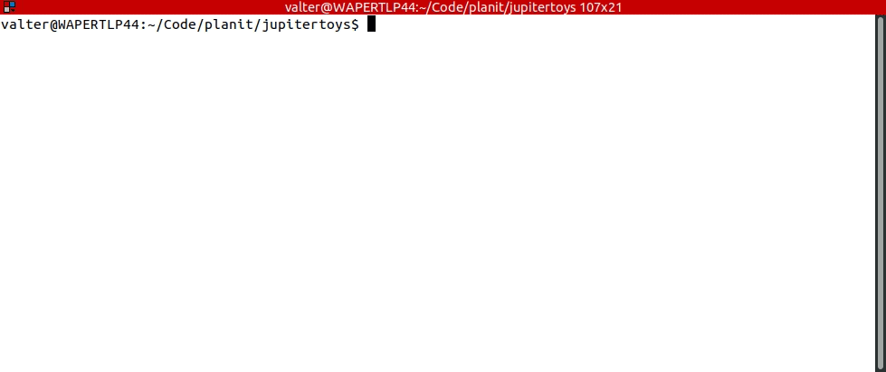
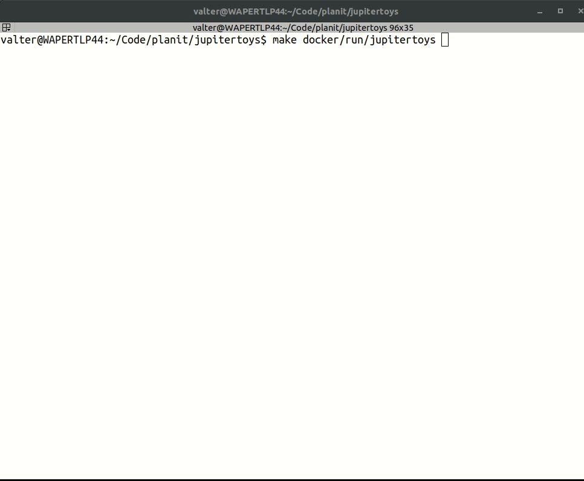
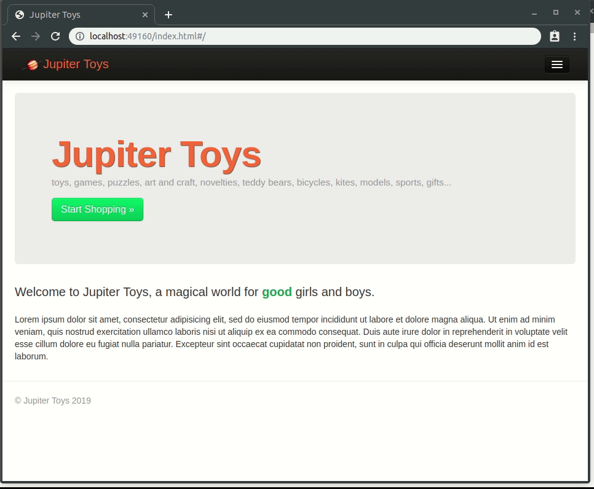
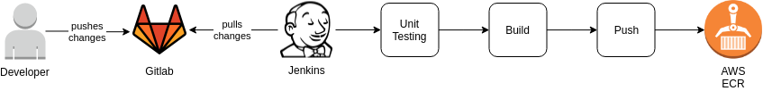

<!-- This file was automatically generated by the `maker`. Make all changes to `README.yaml` and run `make readme` to rebuild this file. -->

![Planit Testing][logo]


# jupitertoys


Welcome to Jupiter Toys, a magical world for good girls and boys.


---


## Screenshots

|:--:|
| * How to build the project using `Maker` and `Docker` * |


|:--:|
| * How to run the project using `Maker` and `Docker` * |


|:--:|
| * How to stop and clean the project using `Maker` and `Docker` * |


## Usage
### How Continuous Integrationg and Delivery works?


### How to build the project using `Maker` and `Docker`
```
make docker/build
```

### How to run the project using `Maker` and `Docker`
```
make docker/run/jupitertoys
```

Jupiter Toys will be available at [http://localhost:49160](http://localhost:49160/index.html#/home)

### How to stop the Docker container
```
make docker/stop/jupitertoys
```

### How to stop and remove the Docker container and image
```
make docker/clean/jupitertoys
```


## Repository

We use [SemVer](http://semver.org/) for versioning. 

- **[Branches][branches]**
- **[Commits][commits]**
- **[Tags][tags]**
- **[Contributors][contributors]**
- **[Graph][graph]**
- **[Charts][charts]**


## Help
**Got a question?**
Feel free to [ask us anything!][contact]


## Commercial Support

[Get in touch with us!][contact]

Want to know more about Planit Testing?
  
- **[About Us][about]**  
At Planit, we specialise in digital quality. We enable clients to accelerate the delivery of quality software with our comprehensive offering of testing services and digital solutions.

- **[Services][services]**
Are you looking to deliver quality applications quicker? We can help.
  
- **[Industries][industries]**  
We work across a wide range of industries including Banking, Finance, Retail, Media, Telecommunications, Education, Professional Services, Resources and Government.

- **[Insights][insights]**  
Check out our latest insights!

- **[Training][training]**  
Planit is a world leader in ISTQB Software Testing, iSQI Agile and BCS Business Analysis training, having built dozens of internationally delivered courses and taught industry best practices to over 30,000 QA professionals.

- **[Join Our Team][join]**  
Planit is on the lookout for valuable new additions to our consulting services, training and corporate divisions.


## Copyright

Copyright © 2019-2019 [Planit Testing][planit]


[logo]: docs/logo.jpg


[planit]: https://www.planittesting.com
[contact]: https://www.planittesting.com/au/Contact
[services]: https://www.planittesting.com/au/Services
[industries]: https://www.planittesting.com/au/Industries
[training]: https://www.planittesting.com/au/Training
[insights]: https://www.planittesting.com/au/Insights
[about]: https://www.planittesting.com/au/about
[join]: https://www.planittesting.com/au/Join-Our-Team

[ansible]: https://ansible.com
[terraform]: http://terraform.io
[packer]: https://www.packer.io
[docker]: https://www.docker.com/
[vagrant]: https://www.vagrantup.com/
[kubernetes]: https://kubernetes.io/
[spinnaker]: https://www.spinnaker.io/
[jenkins]: https://jenkins.io/
[aws]: https://aws.amazon.com/


[branches]: https://git.planittesting.com/research/jupitertoys/branches
[commits]: https://git.planittesting.com/research/jupitertoys/commits
[tags]: https://git.planittesting.com/research/jupitertoys/tags
[contributors]: https://git.planittesting.com/research/jupitertoys/graphs
[graph]: https://git.planittesting.com/research/jupitertoys/network
[charts]: https://git.planittesting.com/research/jupitertoys/charts

